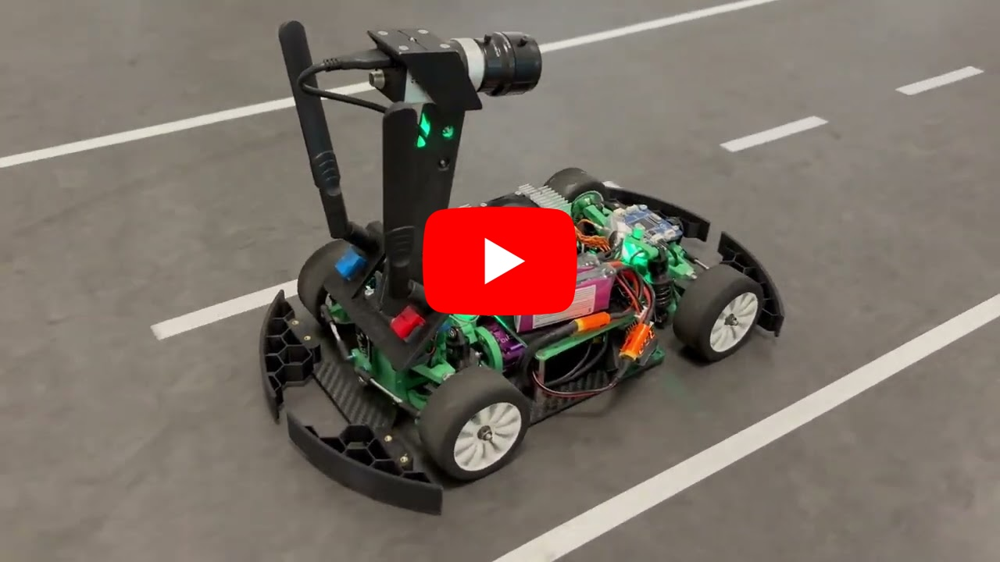
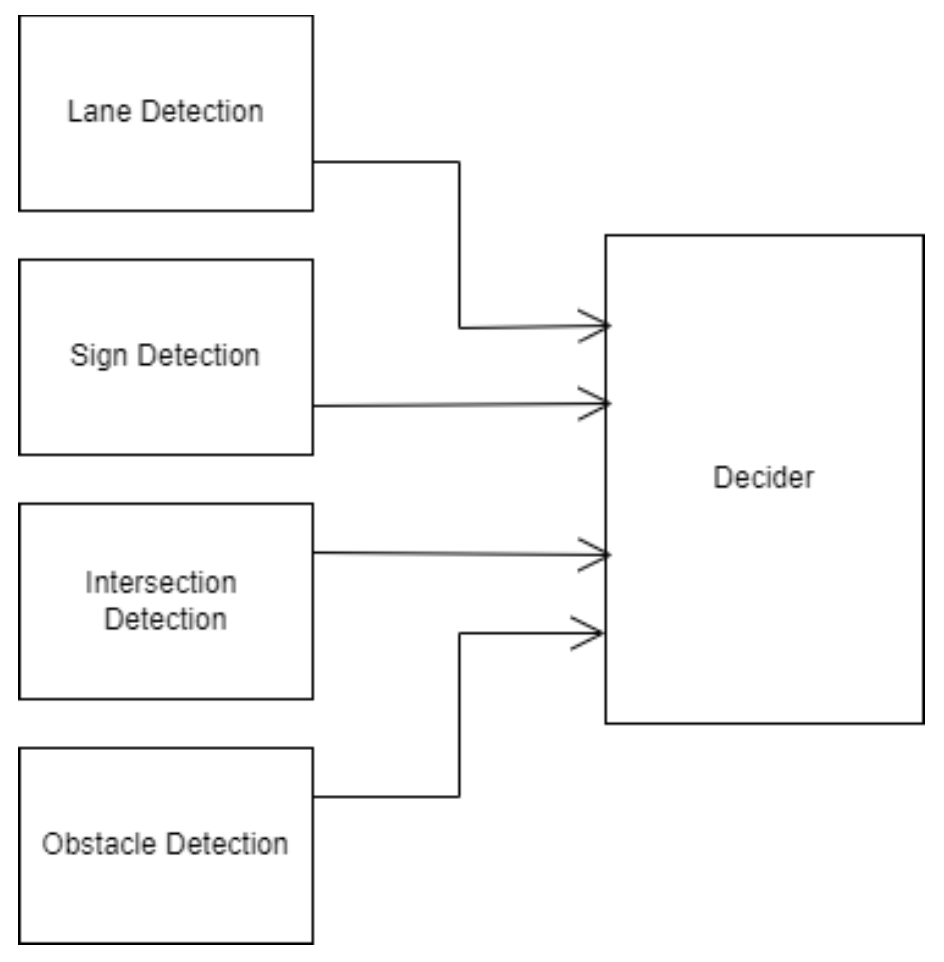
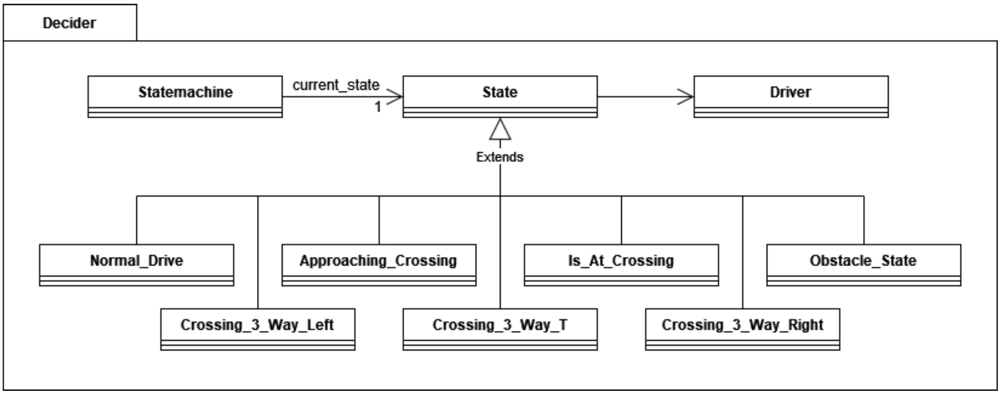
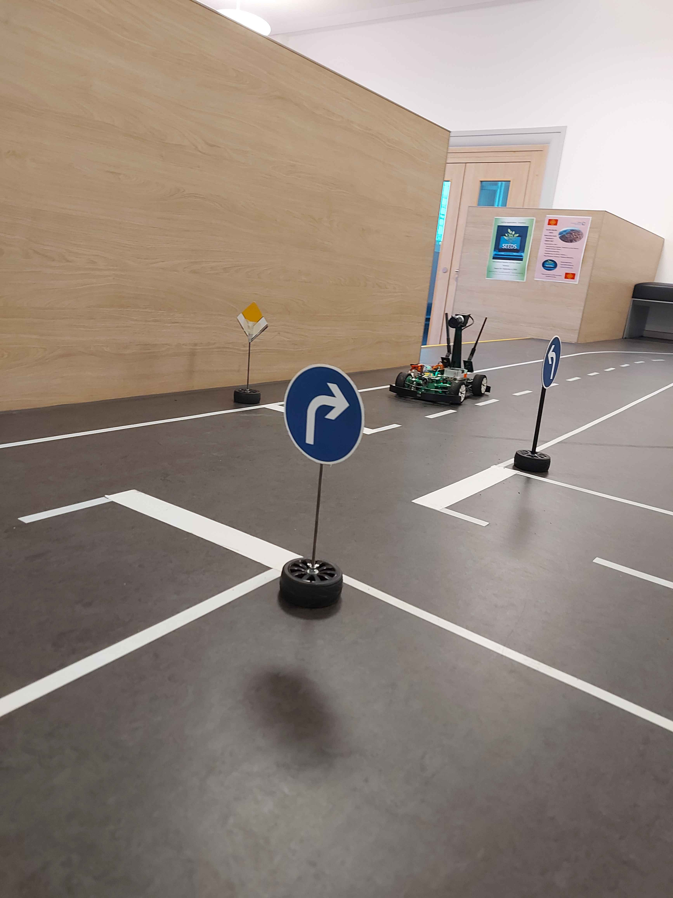
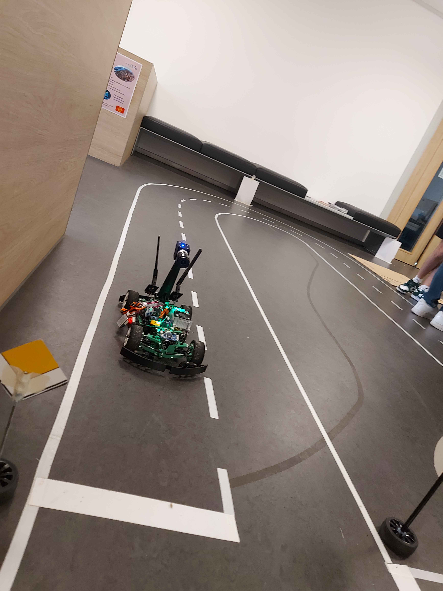
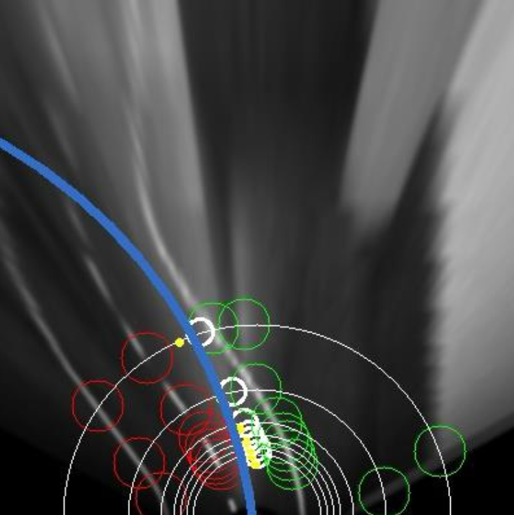
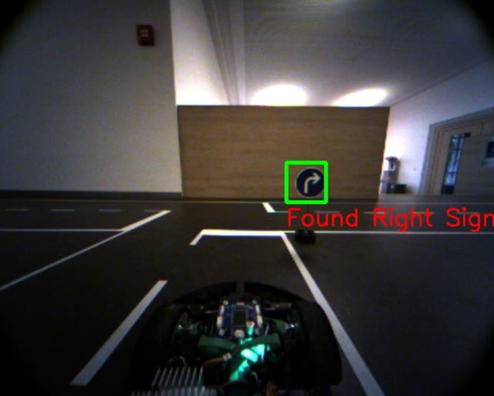
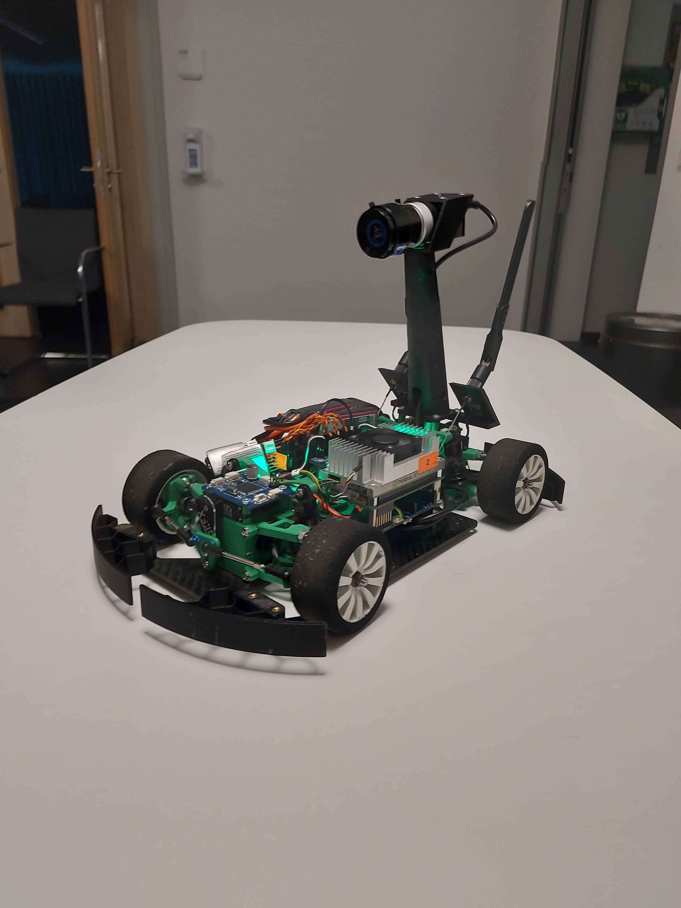
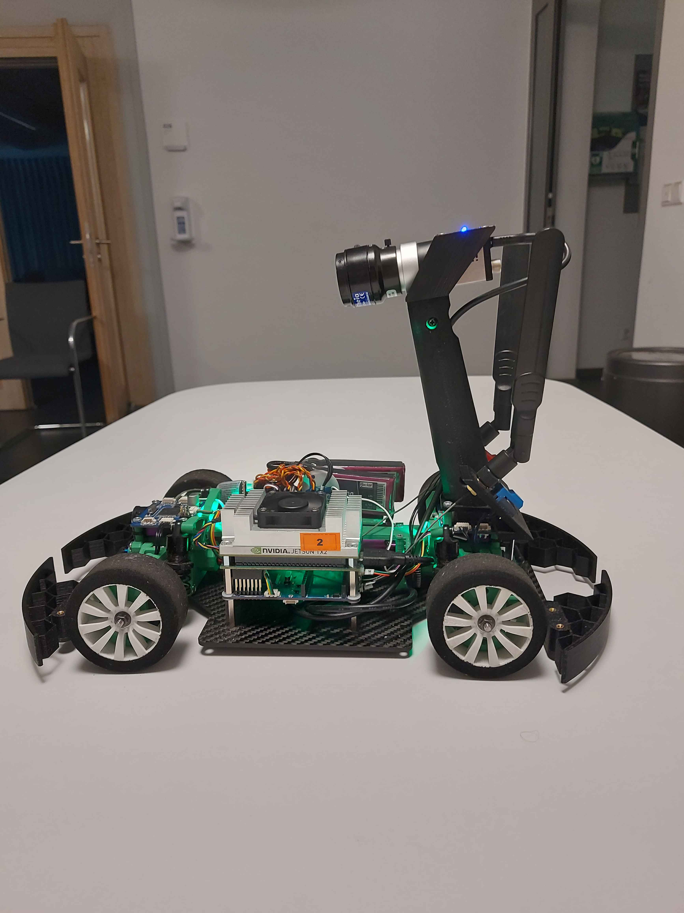

# Self Driving RC Car
Custom RC Car that only uses a camera to navigate a road course. It recognizes and reacts to dynamically placed traffic signs and junctions fully autonomously.

This is a group project for my Autonomous Vehicles University Course (This project recieved a grade of 100%)

## Watch it in action!

https://youtu.be/9W9BECBnpRw

## Architecture

### Lane Detection:
The project uses a Bird's Eye View to generate an overhead perspective of the road. The image is warped and converted to grayscale, providing a sharp view up to 70 cm in front of the car.

Lane detection is done using a circle-based approach, where lines are identified along semicircles. These lines are detected through changes in color, and the lane center is calculated based on the distances between the detected lines.

The steering angle of the car is determined by calculating the distance from the driving circle intersection to the edge of the image. This allows for steering adjustments to stay within the lane. Speed is adjusted based on the curve radius, with tighter curves being taken more slowly.

### Sign Detection:
The traffic sign detection uses a machine learning model to identifiy all of the given traffic signs. We are using OpenCV's Cascade Classifiers since they are simple and effective. Also, the amount of memory is very limited on the car so installing something like tensorflow would be overkill. Each camera frame is successively put through our different trained traffic sign models and if one is detected we publish the sign type and an approximate distance onto the shared memory.

### Intersection Detection:
The approach for intersection detection relies on using the Bird's Eye View which is also used by the lane detection. Steps such as GaussianBlur and the Canny algorithm are used to detect edges and convert them into lines. Histogram analysis is used to identify potential intersections by analyzing line height and position. Classification of the intersection type is based on the number and distribution of vertical lines in the image; The intersection type and distance are then published to the shared memory.

### Obstacle Detection:
The obstacle detection is very simple, but this also makes it very robust in my opinion. The obstacles were given to be green cardboard boxes. Rather than treating them like traffic signs, we analyze the pixels in the middle of the image, between the lanes, for a predefined minimum green value. If this threshold is exceeded, we identify the object as a potential obstacle on the lane and publish to the shared memory. Simple, yet effective.

### Decider:

The Decider is a simple state machine. In the default state, the car just follows the road using the lane detection. The decider is constantly watching the shared memory for any traffic signs, intersections or obstacles.

If a traffic sign is detected it saves it in a buffer to be used for the next intersection. Once an intersection is passed the buffer is cleared.

If an intersection is detected the decider plans its path based upon the intersection type and any recognized traffic signs. The decider goes through the intersection and continues to follow the road normally again.

Finally, if an obstacle is detected, the car stops (I know, amazing). This lasts until the obstacle is removed and the car continues regularly.

## Photo gallery

